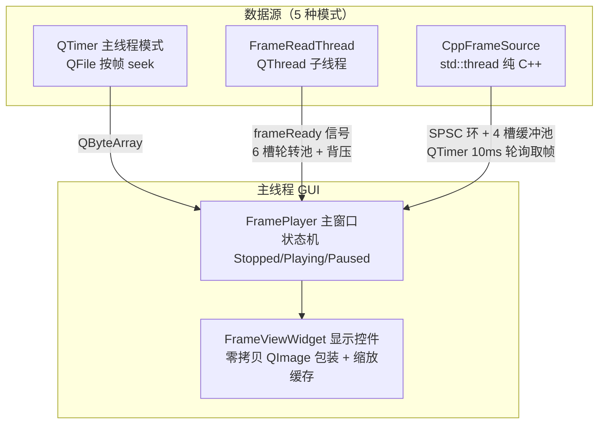

# FramePlayer — 二进制图像帧播放器

基于 **Qt 5 + C++14** 的 Windows 桌面程序，用于加载与实时播放**原始二进制图像帧序列**（无文件头、无压缩的裸帧流），按设定的像素格式与宽高将任意二进制文件切分为帧循环播放。典型用途：算法输出帧回放、FPGA/采集卡裸帧数据校验、相机原始数据离线分析。

[](#编译与运行)
[](#技术栈)
[](#技术栈)

## 设计亮点

- **零拷贝全链路**：子线程 → 队列 → 显示全程不复制帧数据。大帧（2048×2048×RGB888 ≈ 12 MB）播放时无每帧内存分配、无深拷贝
- **SPSC 无锁环形缓冲区**：自研模板类（`SpscRingBuffer.h`），2 的幂容量 + 位掩码取模、本地缓存索引减少跨核原子读、`alignas(64)` 消除伪共享、仅依赖 C++14 标准库
- **帧槽缓冲池 + 所有权移交**：预分配槽位，生产者/消费者之间只移交槽的所有权（经 SPSC 环），运行期零分配
- **背压丢帧**：消费跟不上时主动跳帧保持播放节拍，队列不堆积、内存占用恒定
- **超大文件友好**：文件只开句柄不读内容，按帧 seek，内存占用恒为单帧大小
- **可移植内核**：纯 C++ 帧源（`CppFrameSource`）完全不依赖 Qt，可独立移植到其它工程

## 功能概览

| 能力 | 说明 |
|------|------|
| 像素格式 | RGB888（3B/像素）、RGB565（2B/像素，低字节在前）、灰度8位（1B/像素） |
| 数据源 | 5 种模式，见下表 |
| 文件加载 | 打开文件对话框 或 拖拽文件到窗口（**格式不限**，只要是裸帧数据） |
| 播放控制 | 开始 / 暂停·继续 / 停止 三态；进度条拖动跳转；末尾自动回卷循环 |
| 帧率 | 1–240 fps，运行中可实时调整；左上角叠加**实测帧率** |
| 图像显示 | 等比缩放居中、黑底、缩放缓存（仅新帧/resize 时重采样，paint 只画缓存） |
| 日志 | 自动分配控制台实时输出；同时写滚动文件 `logs/yyyyMMdd_FramePlayer.log`（5 MB × 3 份） |

## 五种数据源模式

| 模式 | 线程模型 | 说明 |
|------|----------|------|
| 本地文件 | 主线程 QTimer | 主线程按帧 seek 读取，简单直接 |
| 本地文件（子线程） | QThread 子线程 | 子线程顺序读帧，信号槽队列发回主线程；6 槽轮转池 + 在途计数背压 |
| 本地文件（纯C++线程） | `std::thread` + SPSC 环 | 完全不依赖 Qt，帧槽缓冲池（4 槽）零拷贝移交，可独立移植 |
| 模拟数据 | 主线程 QTimer | 实时生成移动渐变测试帧，验证各格式渲染 |
| 模拟数据（纯C++线程） | `std::thread` + SPSC 环 | 纯 C++ 子线程生成流线型动态粒子（伪流场 + 拖尾衰减 + HSV 着色） |

## 架构



### 核心模块

```
main.cpp               程序入口，初始化日志，创建主窗口
FramePlayer.*          主窗口：播放状态机、数据源切换、播放控制、帧获取
FrameViewWidget.*      图像显示控件：零拷贝渲染、缩放缓存、实测帧率统计
FrameReadThread.*      QThread 子线程读帧器
CppFrameSource.*       纯 C++ 子线程帧数据源（帧槽池 + SPSC 环 + 粒子模拟）
SpscRingBuffer.h       单生产者单消费者无锁环形缓冲区（模板类，无依赖）
Logger.h               全局日志封装（spdlog：控制台彩色 + 滚动文件，Qt 日志自动汇入）
```

### 零拷贝策略

- **显示层**：`QImage` 直接浅包装外部缓冲（构造函数不复制），调用方保证缓冲存活到下一次 `showFrame()/clear()`；`paintEvent` 只画缩放缓存位图
- **纯 C++ 模式**：4 个预分配帧槽，生产者填充后经 `filledRing` 移交所有权；消费者 `acquireFrame()` 排空只留最新一帧（滞后帧直接回收进 `freeRing`），用完 `releaseFrame()` 归还——**运行期零内存分配**
- **QThread 模式**：`QByteArray` 隐式共享跨线程零拷贝；用 6 槽轮转池绕开"反复 emit 同一缓冲触发写时复制深拷贝"的坑（详见 `FrameReadThread.h` 头注释）
- **背压**：QThread 模式限在途未消费帧数（达到即跳帧）；纯 C++ 模式池满即丢新帧，两层策略都保证队列不无上限堆积

### 线程安全

- 控制量（停止 / 暂停 / 帧率 / 跳转）全部 `std::atomic`，任意线程可随时调用，无锁
- 帧槽经 SPSC 环做所有权移交，同一时刻只有一个线程访问某个槽
- 两种子线程均以 10 ms 小步睡眠推进，及时响应停止 / 暂停 / 帧率调整 / 跳转

### SpscRingBuffer 设计要点

- 容量自动向上取整为 2 的幂，位掩码替代取模
- 本地缓存索引（`headCached_` / `tailCached_`）减少跨核原子读取
- `alignas(64)` 分离生产者 / 消费者热路径，避免伪共享
- 手工对齐分配（`malloc` + 头部存原始指针），不依赖 C++17 `std::align_val_t`
- 仅要求平凡析构 + nothrow 移动类型，编译期 `static_assert` 约束

## 编译与运行

### 环境要求

- **Windows**：Visual Studio 2022（MSVC v143）
- **Qt 5.14.2**（MSVC 2017 编译器），模块：core / gui / widgets
- **spdlog**：header-only，已内置于 `spdlog/` 目录，无需安装
- C++14 标准

### 构建

双击 `FramePlayer.sln` 用 Visual Studio 打开，选择 **Debug 或 Release** 配置生成即可。

工程已预置：
- `/utf-8` 编译选项（源码与控制台输出统一 UTF-8）
- `SPDLOG_WCHAR_FILENAMES`（中文日志/文件路径安全）
- `/std:c++14`

### 运行

编译产物如 `Debug/FramePlayer.exe`。启动后自动弹出控制台窗口显示实时日志，GUI 标题为 **"FramePlayer - 二进制图像播放器"**。

## 使用说明

1. **设置图像参数**（右侧面板）：像素格式 + 宽高 → 帧大小 = 宽 × 高 × 每像素字节数
2. **选择数据源**：5 种 RadioButton 任选
3. **加载或生成帧**：
   - 文件模式：点「打开文件...」或直接拖拽文件到窗口（按 `文件大小 / 帧大小` 自动算总帧数，不足一帧会在状态栏提示）
   - 模拟模式：设置「模拟帧数」（默认 300）
4. **播放控制**：开始 → 暂停/继续 → 停止；播放中可拖进度条跳转（子线程模式会通知线程 seek）、可实时调帧率

### 测试数据

仓库不含生成的 `.bin`（见 `.gitignore`），用脚本一键生成：

```bash
cd TestData
python gen_test_frames.py              # 生成全部三种格式
python gen_test_frames.py rgb888       # 仅 RGB888
python gen_test_frames.py rgb565       # 仅 RGB565
python gen_test_frames.py gray8        # 仅灰度8位
```

生成后得到 320×240 × 60 帧的测试文件，用对应设置打开，画面应显示**水平滚动的彩色渐变**。

## 项目结构

```
FramePlayer/
├── main.cpp                       # 程序入口
├── FramePlayer.h / .cpp / .ui     # 主窗口（状态机 + 播放控制 + 帧获取）
├── FramePlayer.qrc / app.ico      # Qt 资源（图标）
├── FrameViewWidget.h / .cpp       # 图像显示控件（零拷贝 + 缩放缓存 + FPS 统计）
├── FrameReadThread.h / .cpp       # QThread 子线程读帧器
├── CppFrameSource.h / .cpp        # 纯 C++ 帧数据源（SPSC + 帧槽池 + 粒子模拟）
├── SpscRingBuffer.h               # 无锁环形缓冲区（模板类，无外部依赖）
├── Logger.h                       # 日志封装（spdlog）
├── FramePlayer.sln / .vcxproj     # Visual Studio 解决方案/工程
├── spdlog/                        # spdlog header-only 库
└── TestData/
    ├── gen_test_frames.py         # 测试数据生成脚本
    └── *.bin                      # 生成的测试帧（不入库）
```

## 常见问题

**Q：为什么"格式不限"？**
播放器把输入视为无结构的裸字节流，只按 `帧大小 = 宽 × 高 × 每像素字节数` 切分。任何文件（.bin/.dat/.raw/任意扩展名）只要数据布局匹配设定参数即可播放。

**Q：中文路径支持吗？**
支持。QThread 模式用 Qt 自身 Unicode 路径；纯 C++ 模式用 `std::wstring` 传给 `ifstream`（MSVC 原生支持），日志路径走 `SPDLOG_WCHAR_FILENAMES` 宽字符。

**Q：实测帧率总是略低于设定值？**
子线程用 10 ms 步进睡眠对齐帧周期，Windows 默认定时精度约 15.6 ms，且 `1000/fps` 为整数除法（如 30 fps → 33 ms 周期）。60 fps 以内偏差通常在 ±10% 内。

**Q：超大文件会占很多内存吗？**
不会。文件只保持句柄打开、按帧 seek 读取，内存占用恒为单帧大小 + 若干帧槽缓冲。

## 日志

- **控制台**：实时彩色输出操作事件、播放计数、实测帧率
- **文件**：`logs/yyyyMMdd_FramePlayer.log`（5 MB 滚动，保留 3 份，info 级以上立即落盘）
- Qt 环境下 `qDebug` / `qWarning` 自动汇入 spdlog 统一输出

## 技术栈

- **Qt 5.14.2**（Widgets / GUI / Core）
- **C++14**（MSVC v143）
- **spdlog**（header-only 日志）
- **Win32 API**（控制台分配、宽字符路径）

## 许可证

暂未指定开源许可证，默认保留所有权利。如需引用代码请先联系作者。
